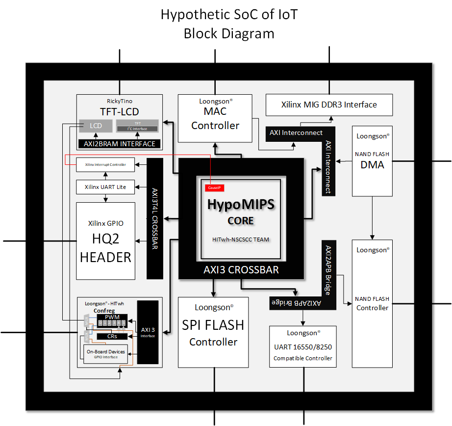
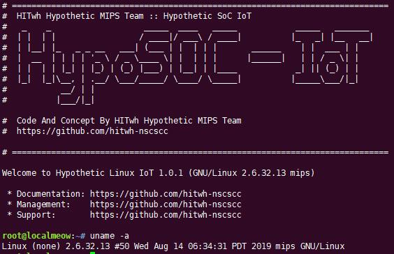
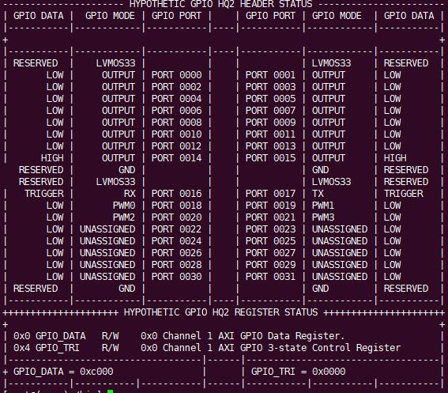

# Hypothetic SoC -  IoT 

Hypothetic SoC -  IoT 以龙芯的 SoC_up为基础，对结构进行了专注于嵌入式物联网方面的重构以及优化，使得 SoC 成为一个完整的嵌入式系统，能够接入IoT边缘设备，并接收、发送、处理相关数据信息。

## Features

- 稳定运行 Pmon 以及定制的 Linux 2.6.32 内核；

- 增加了 RickyTino 开发的 TFT-LCD 显示屏驱动模块；
- 增加了 ArHShRn 开发的 PWM_CNT 计数型脉冲调制模块；
- 增加了 Xlnx Interrupt Controller 以及 Confreg Integrated Interrupt Controller，并可静态配置 intr 是否接入 CauseIP 或者接入 Confreg INT Register，值得注意的是，两种接入方法均采用轮询任务方式；
- 引用了 FPGA 芯片扩展输入输出 EXT_IO，启用了开发板右侧板载 40pin 扩展 IO 接口，全称 Hypothetic GPIO HQ2 Header (abbr. GHQ2)，包含两个 Bank (Bank0 对应 FPGA_EXT_IO 0-15，Bank1 对应 FPGA_EXT_IO_16-31)

- 于 GHQ2 Bank0 配置 16 个三态双向串行数据线，其中 FPGA_EXT_IO14-15 被以软件实现的 Simple I2C Emulator 分时占用，以与基于 I2C 协议的设备进行交流；
- 于 GHQ2 Bank1 配置 2 个 UART Lite 的数据线以及 4 个可控 PWM_CNT 模块的单项输出数据线
- 增加总共 6 个可控 PWM_CNT 模块，其中 4 个挂载于 GHQ2 上，其中 1 个作为 TFT-LCD 屏的非 8080 接口背光亮度控制，剩余 1 个作为 Loongson ConfReg 的总控（仅适用于 CONFREG 种的显示输出设备，例如 LED、数码管等）

作者：Hypothetic CPU team - HITWH NSCSCC